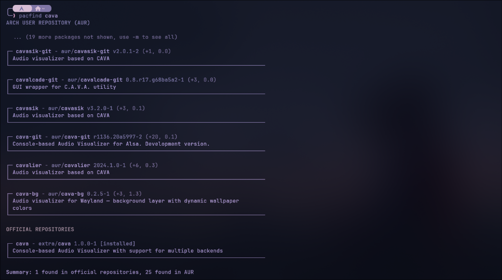

# Pacfind

A minimalist, clean, and blazingly fast command-line search tool for Arch Linux and the Arch User Repository (AUR), written in **Go**.

<p align="center">
  
</p>

## Features

- **Blazingly Fast**: Written in pure Go with zero runtime dependencies. Startup latency is ~2 milliseconds.
- **Bottom-Up Rendering**: Auto-scroll friendly! The most relevant and official packages are printed at the bottom right above your prompt, so you never have to scroll up to find the best match.
- **Sensible Defaults**: Automatically shows the top 6 most relevant packages. Use `-m` to reveal all results.
- **Parallel Search**: Concurrently queries local pacman databases (`pacman -Ss`) and the AUR RPC v5 REST API using lightweight goroutines.
- **Card-Style Interface**: Elegant box-drawing borders (`┌─`, `│`, `└─`), adaptive width wrapping, and subtle color highlights with zero emojis.
- **Installation Detection**: Highlights packages already installed on your system with `[installed]`.
- **AUR Community Metrics**: Displays votes, popularity scores, and `[out-of-date]` warning badges.
- **Interactive Mode**: Built-in `-i` / `--interactive` flag integrating with `fzf` to pick and install packages via `yay` or `pacman`.

## Installation

### Prerequisites
- [Go](https://go.dev/) 1.22+ (for building)
- `pacman` and `yay` (Arch Linux)
- `fzf` (optional, for interactive install mode)

### Build & Install

```bash
git clone https://github.com/<your-username>/Pacfind.git ~/Projects/CLI/Pacfind
cd ~/Projects/CLI/Pacfind
./install.sh
```

Or manually:
```bash
go build -ldflags="-s -w" -o pacfind .
install -m 755 pacfind ~/.local/bin/
```

Make sure `~/.local/bin` is in your `$PATH`.

## Usage

### Basic Search (Default top 6)
```bash
pacfind cava
```

### Show More / All Results
```bash
pacfind -m cava
```

### Custom Limit
```bash
pacfind -l 10 cava
```

### Search Official Repositories Only
```bash
pacfind -o neovim
```

### Search AUR Only
```bash
pacfind -a zen-browser
```

### Top-Down Render (Old order)
```bash
pacfind -t cava
```

### Interactive Install Mode (fzf)
```bash
pacfind -i rofi
```

### Help & Version
```bash
pacfind --help
pacfind --version
```

## License

MIT License
